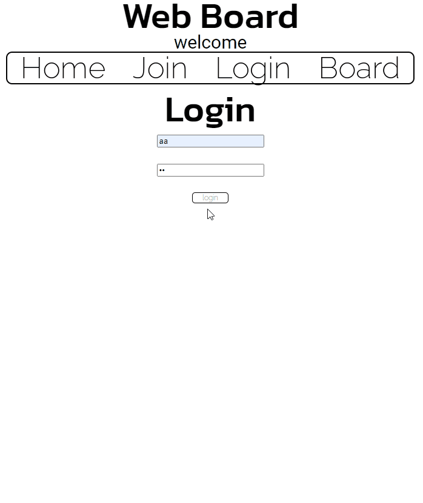
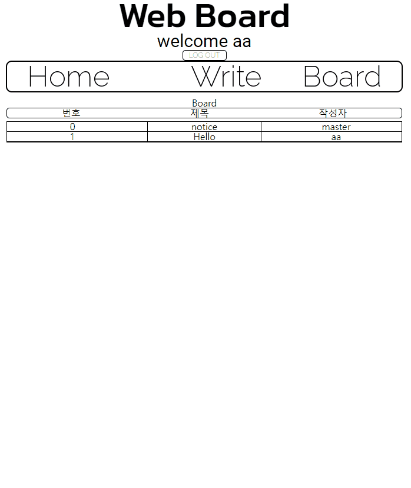
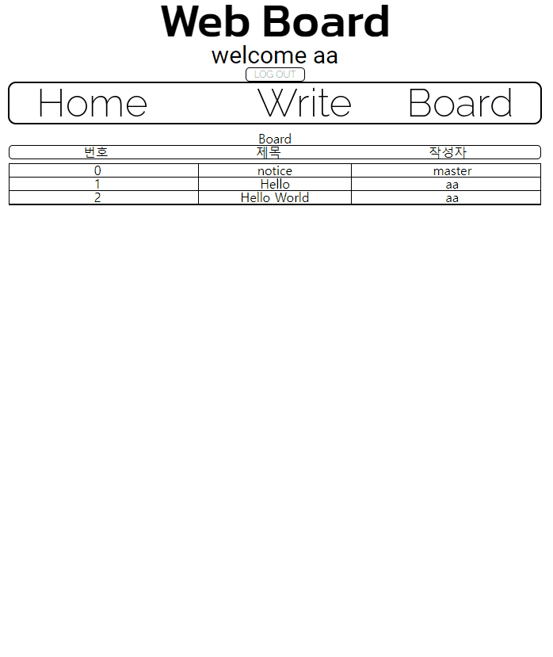
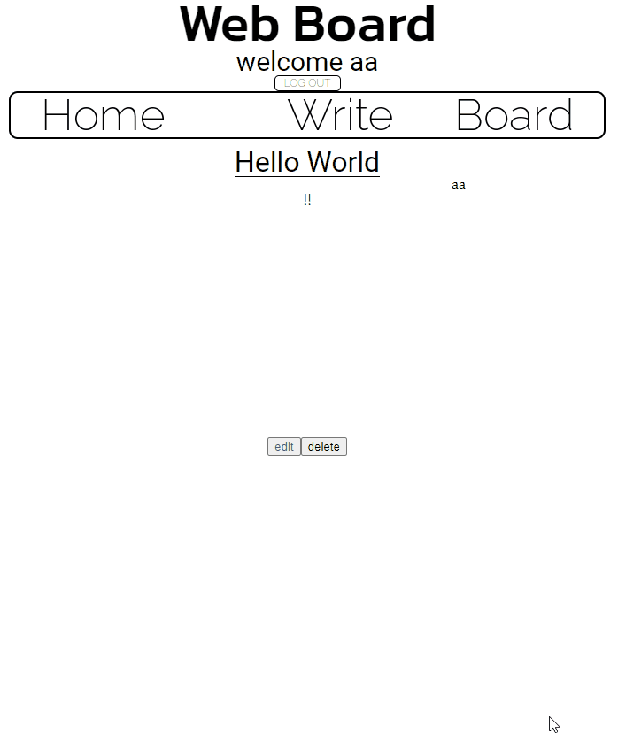

# Web Board

### redux-toolkit을 사용한 페이진 회원가입을 통해 게시판에 글을 게시할 수 있습니다.

- ### 로그인
    </img>
    #### 로그인을 해야 게시글 작성이 가능합니다.
- ### 게시글 작성하기
    </img>
- ### 게시글 열람하기
    </img>
    #### 본인이 작성한 글만 수정및 삭제가 가능합니다.
- ### 게시글 수정하기
    </img>
- ### 게시글 삭제하기
    </img>
- ### 기타
    </img>
    #### 작성자가 아니면 수정및 삭제버튼이 나타나지 않습니다.

## 후기

---
#### redux-toolkit을 회원정보와 게시판 부분에 사용하였고, store에 object를 배열요소로 한 배열형태로 저장하여 로그인,게시글 작성등의 기능이 동작하는 데 활용했습니다. 
#### 처음에는 redux-toolkit을 쓰는 데 적응이 안되어 어려워하다가 어느정도 구현했을 때 부터는 탄력이 붙어 잘됐다가도 어느 순간에는 다시 난관에 부딪혀 조금 힘들기도 하고 어쨌든 극복해낸 경험이였습니다.